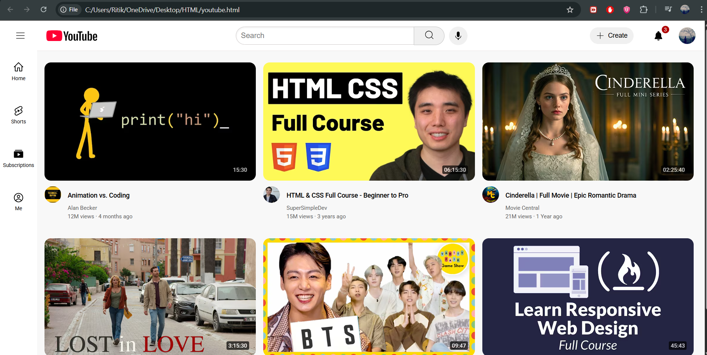

### This is a demo youtube homepage project using HTML and CSS - web deveploment

#### In this demo I learned HTML and CSS web technologies

- HTML and CSS basics
- Semantic elements
- CSS grid
- CSS FlexBox
- CSS Nested Layout
- CSS Nested FlexBox
- CSS Positioning - Absolute and Relative utilized in video time and notifications count on notifcation button precisely
- Z-index - specific stacking of elements on top of other element
- Responsiveness of webpage - tried different screen sizes for different devices like phone, tablet, computer/laptops

This is a beginner level project to showcase practical knowledge in creating webpage using HTML and CSS

